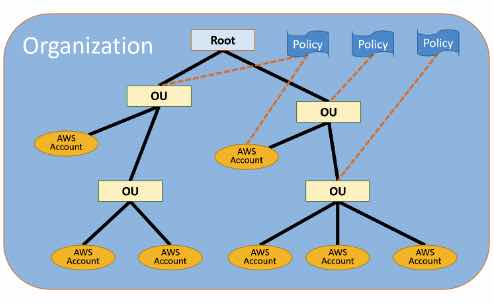

## AWS Management & Governance

### <span style="color:blue">Amazon CloudWatch</span>

#### **Overview**
- **Purpose**: Collect and track metrics, monitor log files, and set alarms for AWS resources.
- **Resources Supported**: EC2, ALB, S3, Lambda, DynamoDB, RDS, etc.

#### **Features**
- **Metrics Collection**:
  - Default resolution: 1-minute intervals.
  - High-resolution metrics: Up to 1-second intervals.
- **Custom Metrics**:
  - EC2 instance metrics: CPU Utilization %, Network Utilization, Disk Read/Write.
  - Custom metrics: Memory Utilization, Disk Space Utilization, Swap Utilization (requires CloudWatch Logs Agent).
- **CloudWatch Dashboards**:
  - Visualize metrics and logs across different AWS accounts and regions.
- **Alarms**:
  - Configure alarms to monitor metrics and trigger actions (e.g., terminate or recover EC2 instances).
- **Events**:
  - Schedule tasks using CloudWatch Events (e.g., Cron jobs).
- **Permissions**:
  - Ensure AWS services have `log:CreateLogGroup`, `log:CreateLogStream`, and `log:PutLogEvents` permissions to write logs.

#### **Custom Metrics Setup**
- Install CloudWatch Logs Agent on EC2 instances to collect custom metrics and logs.
  
### <span style="color:green">AWS CloudTrail</span>

#### **Overview**
- **Purpose**: Provides audit and event history of actions taken by users, AWS services, CLI, or SDK across AWS infrastructure.
- **Default Setting**: Enabled by default for all regions.

#### **Features**
- **Log Delivery**:
  - CloudTrail logs can be sent to CloudWatch Logs or S3 buckets.
- **Use Case**:
  - Monitor and audit actions such as resource deletions, ensuring visibility into all activities across your AWS environment.

#### **Use Case Example**
- Check CloudTrail logs to verify if any resources were deleted without proper authorization or notification.

### <span style="color:purple">Summary Table</span>

| **Feature**          | **Amazon CloudWatch**                                    | **AWS CloudTrail**                                   |
|----------------------|----------------------------------------------------------|------------------------------------------------------|
| **Purpose**          | Collect metrics, monitor logs, and set alarms.           | Audit and event history of actions across AWS.      |
| **Default Setting**  | Metrics collected at 1-minute intervals by default.       | Enabled by default for all regions.                 |
| **Custom Metrics**   | Requires CloudWatch Logs Agent for non-default metrics.   | N/A                                                  |
| **Dashboard**        | Includes graphs from multiple accounts and regions.       | N/A                                                  |
| **Alarms**           | Can terminate or recover EC2 instances based on alarms.    | N/A                                                  |
| **Events**           | Schedule tasks using CloudWatch Events.                   | N/A                                                  |
| **Log Delivery**     | Logs and metrics can be visualized in dashboards.         | Logs can be sent to CloudWatch Logs or S3 buckets.   |
| **Permissions**      | Requires specific log permissions to write logs.          | N/A                                                  |

### AWS CloudFormation

##### <span style="color:blue">Overview</span>

- **Definition**: Infrastructure as Code (IaC) service that enables you to model, provision, and version your entire AWS infrastructure using a text file (JSON or YAML).
- **Purpose**: Create, update, or delete stacks of AWS resources using CloudFormation templates.

#### <span style="color:green">Components of CloudFormation Template</span>

1. **Resources**:
   - **Definition**: AWS resources defined in the template <span style="color:red">(mandatory)</span>.
   - **Example**: EC2 instances, S3 buckets, RDS databases.

2. **Parameters**:
   - **Definition**: Input values provided when creating the stack.
   - **Purpose**: Allow dynamic configuration of resources at stack creation time.
   - **Example**: Instance type, database name.

3. **Mappings**:
   - **Definition**: Static variables in the template.
   - **Purpose**: Define fixed values to be used for resource configuration.
   - **Example**: Region-specific AMI IDs.

4. **Outputs**:
   - **Definition**: Information returned after stack creation.
   - **Purpose**: Provide useful information about resources.
   - **Example**: Elastic IP address, ELB DNS name.

5. **Conditionals**:
   - **Definition**: List of conditions to control resource creation.
   - **Purpose**: Create resources only if certain conditions are met.
   - **Example**: Create resources only if a parameter is set to true.

6. **Metadata**:
   - **Definition**: Additional information about the template.
   - **Purpose**: Provide information used by tools or scripts.

7. **Template Helpers**:
   - **References**:
     - **Definition**: Allows you to refer to other resources in the template.
     - **Example**: `!Ref` to reference a resource.
   - **Functions**:
     - **Definition**: Built-in functions for dynamic values.
     - **Example**: `!GetAtt` to get an attribute from a resource.

#### <span style="color:orange">Advanced Features</span>

- **DependsOn Attribute**:
  - **Purpose**: Specifies the creation order of resources.
  - **Example**: Ensure an RDS instance is created before an EC2 instance.

- **DeletionPolicy Attribute**:
  - **Purpose**: Defines how AWS should handle resources upon stack deletion.
  - **Options**:
    - **Retain**: Preserve resources like S3 even after stack deletion.
    - **Snapshot**: Backup resources like RDS before deletion.

- **Bootstrap Scripts**:
  - **Purpose**: Install packages, files, and services on EC2 instances.
  - **Usage**: Describe in the template for automatic setup.

- **Automatic Rollback**:
  - **Definition**: Enabled by default.
  - **Purpose**: Deletes all resources created successfully up to the point where an error occurred.

- **StackSets**:
  - **Purpose**: Create, update, or delete CloudFormation stacks across multiple accounts, regions, or organizational units (OUs) in AWS.
  - **Usage**: Simplify management of stacks in a multi-account or multi-region environment.

##### <span style="color:purple">Cost</span>

- **Usage**: CloudFormation itself is free.
- **Charges**: Costs are incurred based on the underlying AWS resources defined in the template.

##### <span style="color:teal">Use Cases</span>

- **Environment Setup**: Set up the same infrastructure in different environments (e.g., SIT, UAT, PROD).
- **Cost Management**: Create resources on-demand (e.g., DEV resources during working hours and delete them afterward to lower costs).

## <span style="color:blue">Summary Table</span>

| **Feature**               | **Description**                                            |
|---------------------------|------------------------------------------------------------|
| **Definition**            | Infrastructure as Code (IaC) for AWS resources.            |
| **Template Components**   | Resources, Parameters, Mappings, Outputs, Conditionals, Metadata, Template Helpers. |
| **Advanced Features**     | DependsOn, DeletionPolicy, Bootstrap Scripts, Automatic Rollback, StackSets. |
| **Cost**                  | CloudFormation is free; charges apply to underlying resources. |
| **Use Cases**             | Environment setup, cost management, automated resource provisioning. |


# AWS Elastic Beanstalk

## <span style="color:blue">Overview</span>

- **Definition**: Platform as a Service (PaaS) that simplifies the deployment and management of applications.
- **Purpose**: Enables developers to deploy applications quickly without managing underlying resources.

## <span style="color:green">Features</span>

1. **Automatic Management**:
   - **Deployment**: Handles capacity provisioning, load balancing, auto-scaling, and application health monitoring.
   - **Resource Management**: Manages underlying resources such as EC2 instances, Auto Scaling Groups (ASG), Elastic Load Balancers (ELB), and RDS instances.

2. **Pre-configured Platforms**:
   - **Java**: Apache Tomcat.
   - **PHP/Python**: Apache HTTP Server.
   - **Node.js**: Nginx or Apache HTTP Server.
   - **Ruby**: Passenger or Puma.
   - **.NET**: Microsoft IIS 7.5.
   - **Docker**: Single and Multi Container Docker.

3. **Environment Tiers**:
   - **Web Server Environment**: Serves HTTP requests.
   - **Worker Environment**: Processes background tasks from an Amazon Simple Queue Service (Amazon SQS) queue.

4. **Custom AMI**:
   - **Support**: Allows the use of custom Amazon Machine Images (AMIs).

5. **Multiple Environments**:
   - **Support**: Enables development, staging, and production environments.

6. **Versioning**:
   - **Support**: Stores and tracks application versions over time, allowing easy rollback to previous versions.

## <span style="color:purple">Cost</span>

- **Service Cost**: AWS Elastic Beanstalk itself is free.
- **Resource Cost**: Charges are based on the resources it provisions, including EC2, Auto Scaling, ELB, and RDS.

## <span style="color:teal">Use Cases</span>

- **Rapid Deployment**: Quickly deploy and manage applications without managing infrastructure.
- **Version Control**: Maintain and rollback application versions easily.
- **Development Stages**: Use different environments for development, staging, and production.

## <span style="color:blue">Summary Table</span>

| **Feature**                  | **Description**                                            |
|------------------------------|------------------------------------------------------------|
| **Definition**               | Platform as a Service (PaaS) for application management.   |
| **Automatic Management**     | Capacity provisioning, load balancing, auto-scaling, health monitoring. |
| **Pre-configured Platforms** | Java (Tomcat), PHP/Python (Apache), Node.js (Nginx/Apache), Ruby (Passenger/Puma), .NET (IIS), Docker. |
| **Environment Tiers**        | Web server and worker environments.                       |
| **Custom AMI Support**       | Allows the use of custom Amazon Machine Images.            |
| **Multiple Environments**    | Supports development, staging, and production environments. |
| **Versioning**               | Tracks and manages application versions.                  |
| **Cost**                     | Free service; charges apply to underlying AWS resources.   |
| **Use Cases**                | Rapid deployment, version control, and development stages. |


# AWS ParallelCluster

## <span style="color:blue">Overview</span>

- **Definition**: A tool for deploying and managing High-Performance Computing (HPC) clusters on AWS using a simple text file.
- **Control**: Provides full control over the underlying resources.
- **Cost**: The service itself is free; you only pay for the AWS resources used.

## <span style="color:green">Features</span>

1. **Deployment**:
   - **Configuration**: Use a simple text file to configure and deploy HPC clusters.

2. **Elastic Fabric Adapter (EFA)**:
   - **Capabilities**: Enables OS-bypass for low-latency network communication.

3. **Cost Structure**:
   - **Service Cost**: Free.
   - **Resource Cost**: Charges apply based on the AWS resources used.

---

# AWS Step Functions (SF)

## <span style="color:blue">Overview</span>

- **Definition**: A service for building serverless visual workflows to orchestrate AWS Lambda functions.
- **Configuration**: Define workflows using declarative JSON.

## <span style="color:green">Features</span>

1. **Visual Workflow**:
   - **Creation**: Build and manage workflows that coordinate Lambda functions.

2. **Decider Program**:
   - **Purpose**: Separate activity steps from decision steps for better management.

3. **Serverless**:
   - **Integration**: Works seamlessly with AWS Lambda to handle serverless functions.

---

# AWS Simple Workflow Service (SWF)

## <span style="color:blue">Overview</span>

- **Definition**: A service that enables you to run code on EC2 instances with a focus on workflows.
- **Use Case**: Ideal for processes requiring external signals or interaction between child and parent processes.

## <span style="color:green">Features</span>

1. **Execution**:
   - **Code Location**: Runs on EC2 instances, not serverless.

2. **Use Cases**:
   - **When to Use**: Best for applications requiring external signals or value passing between processes.
   - **Alternative**: For new applications, consider using AWS Step Functions.

## <span style="color:teal">Summary Table</span>

| **Service**            | **Definition**                                    | **Features**                                             | **Cost Structure**                                      |
|------------------------|---------------------------------------------------|----------------------------------------------------------|--------------------------------------------------------|
| **AWS ParallelCluster** | Deploy and manage HPC clusters on AWS.            | Full resource control, Elastic Fabric Adapter (EFA) support. | Free service; pay for AWS resources used.             |
| **AWS Step Functions** | Build serverless workflows to orchestrate Lambda functions. | Visual workflow, decider program for step management.   | Cost depends on usage of Step Functions and Lambda.    |
| **AWS Simple Workflow Service (SWF)** | Run workflows on EC2 with external signals and process interactions. | External signal handling, process value passing.        | Pay for EC2 instances and other resources used.       |


---

### <span style="color:blue">AWS Organizations</span>

#### Overview

**Definition:** A global service used to manage multiple AWS accounts within a single organization.

**Use Cases:** Managing accounts by department, cost center, or environment (e.g., dev, test, prod).

#### Key Features

**Centralized Management:**

- **Accounts:** Manage multiple AWS accounts from a central organization.
- **Billing:** Consolidate billing with a single payment method and benefit from aggregated usage across accounts.

**Organizational Units (OUs):**

- **Hierarchy:** OUs can contain other OUs, creating a hierarchical structure.
- **Management:** Organize accounts into departments, cost centers, or environments.

**Service Control Policies (SCPs):**

- **Application:** SCPs can be applied at the OU or account level.
- **Precedence:** Deny policies take precedence over Allow policies. If an account has an Allow policy at the account level but a Deny policy at the OU level, the effective policy is Deny.
- **Master Account:** The master account retains full control, regardless of SCPs.

**Account Merging:**

- **Process:**
  - Remove all member accounts from the Firm_A organization.
  - Delete the Firm_A organization.
  - Invite the Firm_A master account to join the Firm_B organization as a member account.

**AWS Resource Access Manager (RAM):**

- **Resource Sharing:** Share resources like Transit Gateways, Subnets, AWS License Manager configurations, Route 53 resolver rules, etc., across accounts within the organization.
- **Configuration:** Enable resource sharing at the AWS Organization level.

**AWS Control Tower Integration:**

- **Purpose:** Helps set up and configure new AWS accounts with best practices.
- **Landing Zone:** Provides a base setup called a landing zone for account provisioning.

#### Benefits

- **Centralized Management and Security:** Simplifies the management of multiple accounts and enforces security best practices.
- **Streamlined Billing:** Consolidates billing through a single payer account and benefits from aggregated usage.
- **Simplified Compliance Monitoring:** Provides tools for monitoring and auditing environments across the organization.

---

### <span style="color:blue">AWS Control Tower</span>

AWS Control Tower extends the functionality of AWS Organizations by creating "landing zones" for account onboarding, governance policies, and cloud infrastructure management.

**Key Features:**

- **Landing Zones:**
  - Automate onboarding of new accounts with governance policies.
  - Configure to operate in one or multiple AWS regions.

- **Governance and Compliance:**
  - Apply security, compliance, and operational best practices via blueprints.
  - Monitor resources and policies continuously.

**Benefits:**

- Simplified account onboarding.
- Enhanced governance and compliance management.
- Ongoing infrastructure monitoring.

---

### <span style="color:blue">AWS Service Catalog</span>

AWS Service Catalog helps organizations provide predefined sets of AWS services and tools to their teams, ensuring consistency and security.

**Key Features:**

- **Customizable Bundles:**
  - Define resource bundles via CloudFormation templates.
  - Include prebuilt machine images from the AWS Marketplace.

- **Controlled Access:**
  - Make approved resources available to designated users.
  - Set availability and consumption limits.

**Benefits:**

- Consistent toolsets for teams.
- Simplified resource management.
- Enhanced security and best practices adherence.

---

### <span style="color:blue">AWS License Manager</span>

AWS License Manager helps manage software licenses, ensuring compliance and avoiding violations.

**Key Features:**

- **License Tracking:**
  - Track usage and monitor compliance.
  - Enforce applicable licensing rules.

- **Cost-Effective:**
  - No additional costs for using License Manager.

**Benefits:**

- Simplified license management.
- Compliance monitoring.
- Cost-effective solution.

---

### <span style="color:blue">AWS Artifact</span>

AWS Artifact is a digital repository for compliance-related information about AWS accounts and services.

**Key Features:**

- **Compliance Reports:**
  - Access SOC reports, PCI DSS reports, ISO 27001 certifications, etc.

- **Easy Sharing:**
  - Share compliance-related information with auditors and stakeholders.

**Benefits:**

- Centralized access to compliance information.
- Simplified audit processes.
- Enhanced transparency and accountability.

---

These tools and services enhance the management, compliance, and governance of AWS environments, providing a streamlined and secure approach for organizations.

### <span style="color:blue">AWS Organizations</span>

##### Overview

- **Definition**: A global service used to manage multiple AWS accounts within a single organization.
- **Use Cases**: Managing accounts by department, cost center, or environment (e.g., dev, test, prod).

##### <span style="color:green">Key Features</span>

1. **Centralized Management**:
   - **Accounts**: Manage multiple AWS accounts from a central organization.
   - **Billing**: Consolidate billing with a single payment method and benefit from aggregated usage across accounts.

2. **Organizational Units (OUs)**:
   - **Hierarchy**: OUs can contain other OUs, creating a hierarchical structure.
   - **Management**: Organize accounts into departments, cost centers, or environments.

3. **Service Control Policies (SCPs)**:
   - **Application**: SCPs can be applied at the OU or account level.
   - **Precedence**: Deny policies take precedence over Allow policies. If an account has an Allow policy at the account level but a Deny policy at the OU level, the effective policy is Deny.
   - **Master Account**: The master account retains full control, regardless of SCPs.

4. **Account Merging**:
   - **Process**:
     1. Remove all member accounts from the Firm_A organization.
     2. Delete the Firm_A organization.
     3. Invite the Firm_A master account to join the Firm_B organization as a member account.

5. **AWS Resource Access Manager (RAM)**:
   - **Resource Sharing**: Share resources like Transit Gateways, Subnets, AWS License Manager configurations, Route 53 resolver rules, etc., across accounts within the organization.
   - **Configuration**: Enable resource sharing at the AWS Organization level.

6. **AWS Control Tower Integration**:
   - **Purpose**: Helps set up and configure new AWS accounts with best practices.
   - **Landing Zone**: Provides a base setup called a landing zone for account provisioning.

##### <span style="color:teal">Summary Table</span>

| **Feature**                   | **Description**                                                                                     |
|-------------------------------|-----------------------------------------------------------------------------------------------------|
| **Centralized Management**    | Manage multiple accounts and consolidate billing with a single payment method.                    |
| **Organizational Units (OUs)**| Create a hierarchical structure to manage accounts based on departments, cost centers, or environments. |
| **Service Control Policies (SCPs)** | Apply policies at the OU or account level; Deny takes precedence over Allow.                        |
| **Account Merging**           | Process to merge organizations by removing, deleting, and re-inviting accounts.                   |
| **AWS Resource Access Manager (RAM)** | Share resources across accounts within an organization; enable sharing at the organization level. |
| **AWS Control Tower Integration** | Configure new accounts with best practices and a landing zone.                                    |


### <span style="color:blue">AWS Organizations Cheat Sheet</span>

**AWS Organizations** offers policy-based management for multiple AWS accounts. Here’s a quick summary of its features, administrative actions, key concepts, and more.

### <span style="color:blue">Features</span>
- **Policy Management**: Create groups of accounts and apply policies to those groups.
- **Policy Framework**: Apply policies to a group of accounts or all accounts in your organization.
- **Consolidated Billing**: Set up a single payment method for all AWS accounts in your organization.
  - **View Combined Charges**: See combined charges incurred by all accounts.
  - **Pricing Benefits**: Take advantage of aggregated usage pricing benefits like volume discounts for EC2 and S3.
- **High Availability**: Eventually consistent, replicates data across multiple servers in AWS data centers within its region.

### <span style="color:blue">Administrative Actions</span>
- Create and add new AWS accounts to your organization.
- Add existing AWS accounts to your organization.
- Organize AWS accounts into groups called organizational units (OUs).
- Create a hierarchy that reflects your company’s structure.
- Centrally manage and attach policies to the organization, OUs, or individual AWS accounts.

### <span style="color:blue">Key Concepts</span>
- **Organization**: A collection of AWS accounts managed centrally.
- **Management Account**: The account used to create the organization; cannot be changed.
  - Responsible for paying all charges accrued by the organization.
  - Can create, invite, manage, and remove accounts.
- **Member Account**: Any AWS account part of the organization, other than the management account.
  - Can belong to only one organization at a time.
- **Administrative Root**: The top-most container in the hierarchy of the organization.
  - Used to create and organize OUs.
- **Organizational Unit (OU)**: A group of AWS accounts within the organization.
  - Can contain other OUs to form a hierarchy.
- **Policy**: A document with statements defining controls for AWS accounts.
- **Service Control Policy (SCP)**: Specifies services and actions that users and roles can use in the accounts.

###### <span style="color:blue">AWS Organizations Feature Sets</span>
- **Consolidated Billing Only**: Basic management tools to centrally manage accounts.
- **All Features Enabled**: Includes consolidated billing and advanced features like SCPs.


##### <span style="color:blue">Organization Hierarchy</span>
- The hierarchy can be five levels deep, including root and AWS accounts created in the lowest OUs.
- Policies can be inherited and assigned at different points in the hierarchy.
- Tags can be attached to OUs, the organization’s root, and policies to implement attribute-based access control (ABAC).


##### <span style="color:blue">AWS Organizations Pricing</span>
- AWS Organizations is free.


---

### <span style="color:blue">AWS Config</span>

**AWS Config** tracks the configuration state of your AWS resources at a point in time. Think of AWS Config as a time machine. You can use it to see what a resource configuration looked like at some point in the past versus what it looks like now.

- **Resource Relationship:** Shows how resources are related to one another and how changes might impact each other.
- **Difference from CloudTrail and EventBridge:** 
  - **CloudTrail** logs events.
  - **EventBridge** alerts on events.
  - **AWS Config** gives a holistic view of resources and their configurations over time.

#### Key Objectives

1. **Security**
   - Notify on resource configuration changes, alerting potential breaches.
   - Track user permissions at given times.

2. **Easy Audit Reports**
   - Provide configuration snapshots for audit purposes.

3. **Troubleshooting**
   - Analyze configurations around problem occurrences.
   
4. **Change Management**
   - Assess impacts of changes on other resources.

#### Components

- **Configuration Recorder**
  - Discovers resources, records configurations, monitors changes.
  - Can monitor all items in a region or specific resource types.
  - One configuration recorder per region.

- **Configuration Items**
  - Generated for each resource monitored, detailing settings, relationships, and timestamps.
  - Stored internally and maintained even after resource deletion.

- **Configuration History**
  - Collection of configuration items for a resource over time.
  - Delivered to an S3 bucket every six hours during changes.

- **Configuration Snapshots**
  - Collection of all configuration items at a point in time.
  - Delivered to S3 buckets at specified intervals.
  
- **Monitoring Changes**
  - Generates new configuration items on resource creation, changes, or deletion.
  - Retention period configurable between 30 days to 7 years.

- **Recording Software Inventory**
  - Tracks software inventory changes on EC2 instances and on-premises servers using AWS Systems Manager.

- **Managed and Custom Rules**
  - Specifies rules for optimal baseline configurations.
  - Provides predefined rules for common scenarios.
  - Flags noncompliant resources and generates SNS notifications.

#### CLI Commands

- **Deliver Configuration Snapshot:**
  ```bash
  aws configservice deliver-config-snapshot --delivery-channel-name default
  ```
- **Reconfigure Delivery Channel:**
  ```bash
  aws configservice put-delivery-channel --delivery-channel file://deliveryChannel.json
  ```
- **Start/Stop Configuration Recorder:**
  ```bash
  aws configservice stop-configuration-recorder --configuration-recorder-name default
  aws configservice start-configuration-recorder --configuration-recorder-name default
  ```

##### <span style="color:blue">Comparison: AWS Config, CloudWatch, and CloudTrail</span>

| **Service**      | **Purpose**                                                                                           | **Key Features**                                                                                                                                                        | **Use Cases**                                                                                         |
|------------------|-------------------------------------------------------------------------------------------------------|-------------------------------------------------------------------------------------------------------------------------------------------------------------------------|-------------------------------------------------------------------------------------------------------|
| **AWS Config**   | Records resource configurations and relationships over time.                                          | - Configuration snapshots and history<br>- Managed and custom rules<br>- Monitors changes<br>- Resource relationships and dependencies                                  | - Auditing and compliance<br>- Change management<br>- Troubleshooting configuration issues            |
| **CloudWatch**   | Tracks performance metrics and logs, takes action based on metrics.                                   | - Performance metrics tracking<br>- Log collection and consolidation<br>- Alarms and notifications<br>- Custom metrics extraction                                       | - Monitoring application performance<br>- Automating responses to metric thresholds                   |
| **CloudTrail**   | Logs activities performed on your AWS account for security and auditing.                              | - Detailed event logs<br>- Tracks management and data events<br>- Supports event filtering and alerting                                                                 | - Security auditing<br>- Compliance reporting<br>- Forensic analysis of account activity              |
| **EventBridge**  | Event-driven architecture to respond to changes in your environment.                                  | - Event filtering<br>- Event routing<br>- Integration with various AWS services and external applications                                                               | - Automating workflows<br>- Real-time data processing<br>- Triggering actions based on specific events |

---

